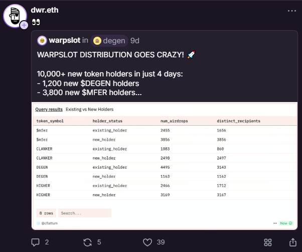

# warpslot-poc

This is a small POC involving warpsolt frame and why you should check context data in Farcaster frames V2.
It's also a lib(target=node) if you want to trigger your spins programatically, but may break if the frame changes.

## POC

The warpslot frame gives 5 spins per day to each facrcaster user, on each spin you can win some meme token.
To have better UX, the frame just uses the FID that comes from farcaster SDK context, this means anyone can trigger the spin for any FID.
Though I understand is nicer for UX, it's a good idea to add some data validation that checks that the FID is not spoofed.
IMO the purpose of the frame is just a glorified airdrop, but people give it more relevance:

Exibit A:


## Data analysis

I did a small sample of spins to test the data here are the results:

```plain
Total spins: 2318
HIGHER: 1 wins, 2 losses
RUNNER: 330 wins, 1162 losses
DEGEN: 48 wins, 239 losses
MFER: 36 wins, 143 losses
DICKBUTT: 30 wins, 96 losses
QR: 18 wins, 54 losses
GDUPI: 31 wins, 127 losses
HIGHER: 0.024345474029817144 USD
RUNNER: 9.76758749999997 USD
DEGEN: 0.7324081509432535 USD
MFER: 0.5353555556139362 USD
DICKBUTT: 1.5556838760802545 USD
QR: 3.1981489652453168 USD
GDUPI: 9.850139641177924 USD
Total wins: 494
Total losses: 1824
Total win amount: 25.663669163090468 USD
```

These ~2k spins were made in less then 5 minutes, we can see that the total amount of wins is ~25$, all reward types were of type 'SMALL'.

## Use as a library

bun/deno/node add warpslot-poc as dependency

```ts
import { doCheckSpins, } from "warpslot-poc";

// this is the sig of the method with default params
// export const doCheckSpins = async ({
//     fids,
//     checkSpinInterval = 20000,
//     logWins = false,
//     doConsoleLog = false,
//     logFn = console.log
// }: {
//     fids: number[],
//     checkSpinInterval?: number,
//     logWins?: boolean,
//     doConsoleLog?: boolean,
//     logFn?: (...args: any[]) => void
// }): Promise<void>

doCheckSpins(
    [3,1791,22314] // fids to check and do spin for
)
```

Interval will default to 20s, logWins will default to false, if logWins is true, it will log the win amount to a wins.txt file.
You can also pass a custom logFn, if you want to log to a file or capture the log differently.
If you want to stop the interval at some point you can import `SpinIntervalController` and use it like this:

```ts
import { SpinIntervalController, doCheckSpins } from "warpslot-poc";

doCheckSpins( [3,1791,22314])

// Call this at any point to stop the interval 
// It will stop the execution of the interval at the next iteration
SpinIntervalController.setStopSpinning(true)
```

### License

MIT
